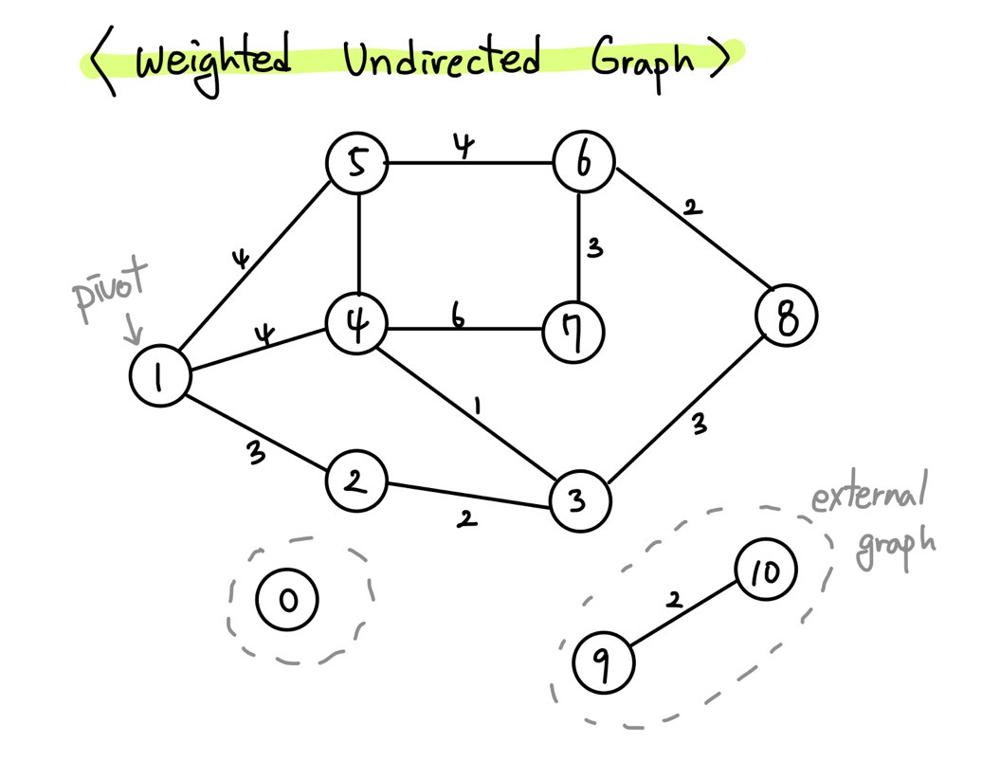

## 2020-2 Fall 알고리즘 분석 hw3

### BFS

### Dijkstra

### Bellman-For

### Floyd-Warshall

### Johnson’s algorithm

### test case
</img>
Main.java의 public static void test() 메서드를 실행하면 test.txt를 읽어 다익스트라 알고리즘을 실행한다.  
위의 이미지는 test.txt가 나타내는 그래프를 시각화 한 것.
